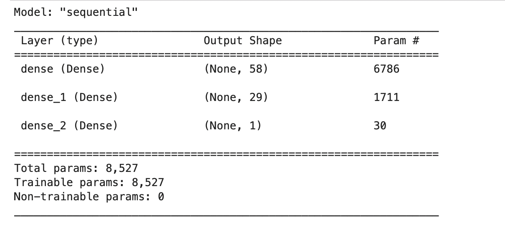
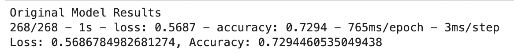
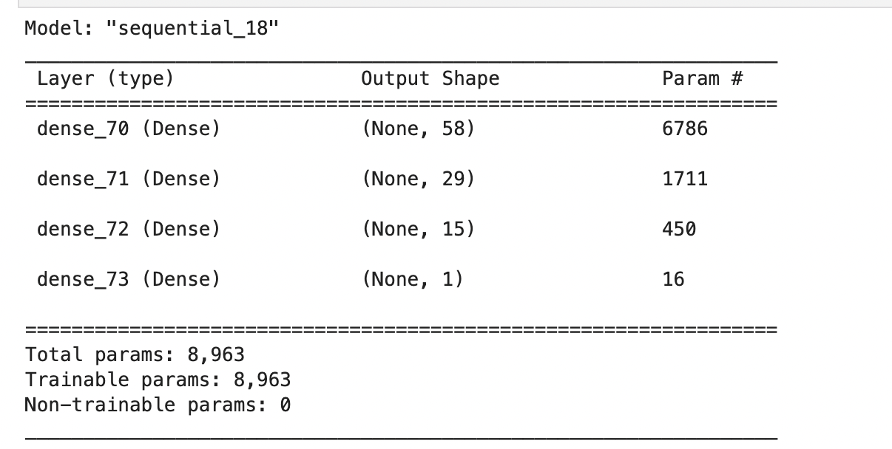
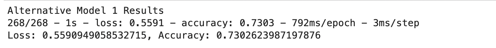
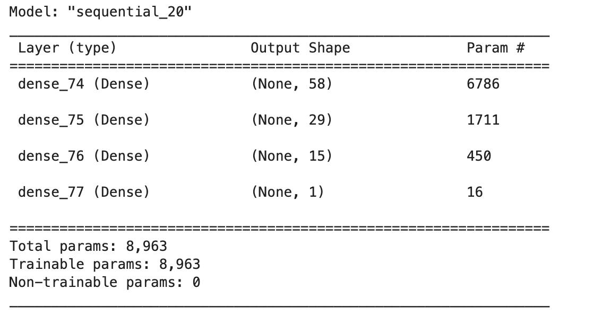
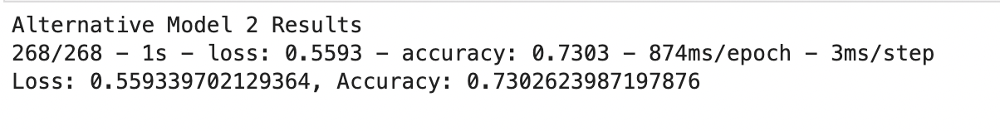

## Funding Success AI with Deep Learning

The project involves developing a deep neural network-based binary classification model to predict the success of startups funded by Alphabet Soup, a venture capital firm. The model will be trained on a dataset containing information on over 34,000 organizations that received funding from Alphabet Soup. The project includes preprocessing the data, creating and evaluating a neural network model, and optimizing the model to improve its accuracy. At least two attempts at optimization will be made, including adjustments to input data, hidden layers, activation functions, and training epochs. The final models will be saved as HDF5 files for future use.

## Table of Contents

- [Technologies](#technologies)
- [Models](#models)
- [Conclusion](#conclusion)
- [Models Results Summary](#models-results-summary)
- [Installation](#installation)
- [Instructions](#instructions)
- [Contributors](#contributors)
- [License](#license)

## Technologies

This project leverages the following technologies:
* [Python 3.7.13](https://www.python.org/downloads/release/python-385/) - The programming language used in the project.
* [Pandas](https://pandas.pydata.org/) - A Python library used for efficient data manipulation.
* [Jupyter Lab](https://jupyter.org/) - An interactive development environment used to create and share documents containing live code, equations, visualizations, and narrative text.
* [TensorFlow](https://www.tensorflow.org/) -  An open-source machine learning framework for creating, training, and evaluating deep learning models.
* [Keras](https://keras.io/) - A high-level neural networks API, written in Python, and running on top of TensorFlow.
* [scikit-learn](https://scikit-learn.org/stable/) - A machine learning library that provides tools for data preprocessing, model selection, and evaluation.

## Models:

* Original Model
Layer details:
| Type                 | Shape | Activation |
| -------------------- | ----  | ---------- |
| Dence hidden layer 1 |  58   |    Relu    |
| Dence hidden layer 2 |  29   |    Relu    |
| Dence output layer   |  1    |   Sigmoid  |

  * Loss function: `binary_crossentropy`
  * Optimizer: `adam`
  * Metrics: `accuracy`
  * Epochs: `50`

<a href="images/original_model_summary.png">
  
</a>
<a href="images/original_model_accuracy.png">
  
</a>

* Alternative Model 1
Layer details:
| Type                 | Shape | Activation |
| -------------------- | ----  | ---------- |
| Dence hidden layer 1 |  58   |    Relu    |
| Dence hidden layer 2 |  29   |    Relu    |
| Dence hidden layer 3 |  15   |    Relu    |
| Dence output layer   |  1    |   Sigmoid  |

  * Loss function: `binary_crossentropy`
  * Optimizer: `adam`
  * Metrics: `accuracy`
  * Epochs: `100`

<a href="images/alt_model1_summary.png">
  
</a>
<a href="images/alt_model1_accuracy.png">
  
</a>

* Alternative Model 2
Layer details:
| Type                 | Shape | Activation |
| -------------------- | ----  | ---------- |
| Dence hidden layer 1 |  58   |    Tanh    |
| Dence hidden layer 2 |  29   |    Tanh    |
| Dence hidden layer 3 |  15   |    Tanh    |
| Dence output layer   |  1    |   Sigmoid  |

  * Loss function: `binary_crossentropy`
  * Optimizer: `tanh`
  * Metrics: `accuracy`
  * Epochs: `150`

<a href="images/alt_model2_summary.png">
  
</a>
<a href="images/alternative_model2_accuracy.png">
  
</a>

## Conclusion 
After evaluating the performance of the Original Model and two Alternative Models, we can see that Alternative Model 1 and Alternative Model 2 both achieved slightly higher accuracy than the Original Model. Although the differences in accuracy are small, it is worth noting that Alternative Model 1 has an additional hidden layer compared to the Original Model, while Alternative Model 2 has the same architecture as Alternative Model 1 but with twice the number of epochs.

* Based on these results, we could further improve the models by exploring the following future steps:

* Experiment with different architectures by adding more hidden layers or varying the number of neurons in each layer.
* Adjust the training parameters, such as learning rate or batch size, to find the optimal combination for the given problem.
* Implement early stopping or other regularization techniques to prevent overfitting and improve generalization.
* Perform feature selection or engineering to identify the most important features and potentially reduce the complexity of the model.

The trained models can be found in the `alternative_models` folder in the repository.

### Models Results Summary

| Model                | Loss   | Accuracy |
|----------------------|--------|----------|
| Original Model       | 0.5687 | 0.7294   |
| Alternative Model 1  | 0.5591 | 0.7303   |
| Alternative Model 2  | 0.5593 | 0.7303   |


## Installation

1. Clone this repository to your local machine:
```
git clone https://github.com/your_username/alphabet-soup-funding-predictor.git
```
2. Navigate to the project directory and create a virtual environment:
```
cd alphabet-soup-funding-predictor
python -m venv venv
```
3. Activate the virtual environment:
* Windows:
```
venv\Scripts\activate
```
* macOS/Linux:
```
source venv/bin/activate
```
4. Install all the required libraries:

```
pip install pandas tensorflow scikit-learn
```
5. Run the Jupyter Notebook to train and evaluate the models

6. Open the `venture_funding_with_deep_learning.ipynb` notebook in the Jupyter Notebook interface and run the cells in sequence to preprocess the data, compile and evaluate the models, and optimize the neural network.

Please note that depending on your system, training and evaluating the models may take some time. Adjust the parameters (e.g., number of epochs, batch size) as needed to achieve the desired results in a reasonable timeframe.

## Instructions:
The steps are broken out into the following sections:

* Prepare the data for use on a neural network model.

* Compile and evaluate a binary classification model using a neural network.

* Optimize the neural network model.

#### Prepare the Data for Use on a Neural Network Model
Complete the following data preparation steps:

* Read the `applicants_data.csv` file into a Pandas DataFrame. Review the DataFrame, looking for categorical variables that will need to be encoded, as well as columns that could eventually define your features and target variables.

* Drop the “EIN” (Employer Identification Number) and “NAME” columns from the DataFrame, because they are not relevant to the binary classification model.

* Encode the dataset’s categorical variables using `OneHotEncoder`, and then place the encoded variables into a new DataFrame.

* Add the original DataFrame’s numerical variables to the DataFrame containing the encoded variables.

> **Note** To complete this step, you will employ the Pandas concat() function that was introduced earlier in this course.

5. Using the preprocessed data, create the features (`X`) and target (`y`) datasets. The target dataset should be defined by the preprocessed DataFrame column “IS_SUCCESSFUL”. The remaining columns should define the features dataset. 

6. Split the features and target sets into training and testing datasets.

7. Use scikit-learn's `StandardScaler` to scale the features data.

### Compile and Evaluate a Binary Classification Model Using a Neural Network

Use TensorFlow to design a binary classification deep neural network model. This model should use the dataset’s features to predict whether an Alphabet Soup&ndash;funded startup will be successful based on the features in the dataset. Consider the number of inputs before determining the number of layers that your model will contain or the number of neurons on each layer. Then, compile and fit your model. Finally, evaluate your binary classification model to calculate the model’s loss and accuracy. 
 
To do so, complete the following steps:

1. Create a deep neural network by assigning the number of input features, the number of layers, and the number of neurons on each layer using Tensorflow’s Keras.

> **Hint** You can start with a two-layer deep neural network model that uses the `relu` activation function for both layers.

2. Compile and fit the model using the `binary_crossentropy` loss function, the `adam` optimizer, and the `accuracy` evaluation metric.

> **Hint** When fitting the model, start with a small number of epochs, such as 20, 50, or 100.

3. Evaluate the model using the test data to determine the model’s loss and accuracy.

4. Save and export your model to an HDF5 file, and name the file `AlphabetSoup.h5`. 

### Optimize the Neural Network Model

Using TensorFlow and Keras, optimize your model to improve the model's accuracy. Even if you do not successfully achieve a better accuracy, you'll need to demonstrate at least two attempts to optimize the model

To do so, complete the following steps:

1. Define new deep neural network models. With each, try to improve on your first model’s predictive accuracy.

> **Rewind** Perfect accuracy has a value of 1, so accuracy improves as its value moves closer to 1. To optimize your model for a predictive accuracy as close to 1 as possible, you can use any or all of the following techniques:
>
> * Adjust the input data by dropping different features columns to ensure that no variables or outliers confuse the model.
>
> * Add more neurons (nodes) to a hidden layer.
>
> * Add more hidden layers.
>
> * Use different activation functions for the hidden layers.
>
> * Add to or reduce the number of epochs in the training regimen.

2. After finishing your models, display the accuracy scores achieved by each model, and compare the results.

3. Save each of your models as an HDF5 file.

### Contributors
Alexander Likhachev

### License
MIT